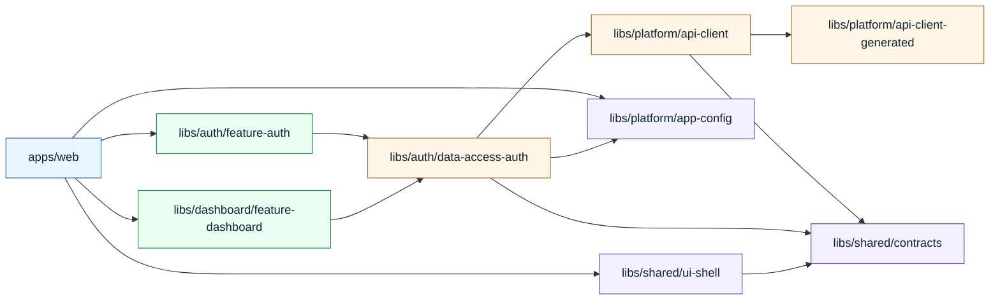

# Architecture Guide

This document defines how the workspace is structured, how dependencies are allowed to flow, and how to add new features without degrading maintainability.

## Goals

- Keep domain logic isolated and evolvable
- Enforce predictable dependency direction
- Scale teams and features without accidental coupling
- Support CI-friendly incremental builds and checks

## High-Level Structure

- `apps/web` contains application bootstrap, routing composition, and app-wide configuration.
- `libs/auth/*` contains authentication feature and auth data access.
- `libs/dashboard/*` contains dashboard feature UI and composition.
- `libs/platform/*` contains environment configuration and API adapter layer.
- `libs/shared/*` contains reusable contracts and shell UI components.

## Dependency Direction

The repository enforces dependency boundaries via Nx tags in `eslint.config.mjs`.

### Scope Rules

- `scope:shared` depends only on `scope:shared`
- `scope:platform` depends on `scope:platform` and `scope:shared`
- `scope:auth` depends on `scope:auth`, `scope:platform`, `scope:shared`
- `scope:dashboard` depends on `scope:dashboard`, `scope:auth`, `scope:platform`, `scope:shared`
- `scope:web` depends on application-facing scopes (`scope:auth`, `scope:dashboard`, `scope:platform`, `scope:shared`)

### Layer Rules

- `type:contracts` is leaf-level type contracts
- `type:util` depends on `type:util` and `type:contracts`
- `type:generated` depends on `type:generated` and `type:contracts`
- `type:data-access` depends on `type:data-access`, `type:util`, `type:contracts`, `type:generated`
- `type:ui` depends on `type:ui`, `type:util`, `type:contracts`
- `type:feature` depends on `type:feature`, `type:data-access`, `type:ui`, `type:util`, `type:contracts`

## Diagram

## Request Flow Example

1. User opens `/dashboard` in `apps/web`.
2. Route guard from `libs/auth/data-access-auth` validates session state.
3. Feature UI (`libs/dashboard/feature-dashboard`) consumes auth/session facade signals.
4. API calls go through `libs/platform/api-client` adapters.
5. Adapter contracts are mapped from generated models in `libs/platform/api-client-generated`.

## Feature Development Pattern

1. Add `libs/<domain>/feature-<name>` for UI and route composition.
2. Add `libs/<domain>/data-access-<name>` for state/API orchestration.
3. Reuse `libs/shared/contracts` for DTO/view contracts.
4. Keep direct HTTP logic out of feature components.
5. Enforce tags in project configs to preserve dependency rules.

## Cross-Cutting Concerns

- App environment injection lives in `libs/platform/app-config`.
- Auth token handling and route protection live in `libs/auth/data-access-auth`.
- Shared shell/navigation belongs in `libs/shared/ui-shell`.
- Localization extraction/build targets are configured in `apps/web/project.json`.

## Quality Gates

- Lint: `npm run lint`
- Unit tests: `npm run test`
- E2E: `npm run e2e`
- Production build: `npm run build`
- Affected CI command: `npm run affected:ci`

## Decision Record Notes

When changing boundary rules or dependency direction:

1. Update `eslint.config.mjs` constraints.
2. Update this document with revised flow and rationale.
3. Verify with full lint/test/build before merge.
